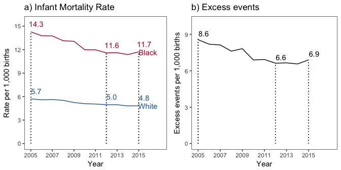
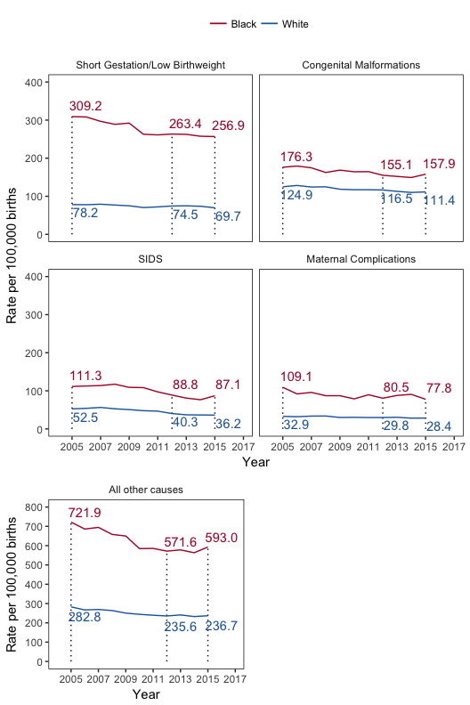

Understanding the recent increase in black infant mortality in the US
================

Corinne A Riddell, PhD

Sam Harper, PhD

Jay S Kaufman, PhD

Department of Epidemiology, Biostatistics and Occupational Health, McGill University, Montreal, Canada.

Address correspondence to: Corinne Riddell, PhD, Department of Epidemiology, Biostatistics & Occupational Health, McGill University, 1020 Pine Avenue West, Room 36B, Montreal, QC H3A 1A2, Canada. Email: <corinne.riddell@mail.mcgill.ca>

Current word count (text only, exclusive of title, references, and tables): 600

Date of last revision: March 28, 2017

**Introduction**

The infant mortality rate is an important indicator of population health. A recent report from the Centers for Disease Control and Prevention reported that the US infant mortality rate decreased by 15% in the past decade.1 The objective of this research letter is to establish if both blacks and whites benefitted equally from this decrease. We investigated recent trends in the absolute difference in the overall and cause-specific infant mortality rates between non-Hispanic black and whites.

**Methods**

We abstracted data on live births and deaths in the first year of life for Non-Hispanic black and white infants from the US National Vital Statistics System for 2005-2015. The infant mortality rate was calculated as the number of deaths (mortality file)2 divided by the number of births (natality file)3, according to race-ethnicity, year, and cause of death. We calculated rates for the top four causes of infant death and for a residual category encapsulating all other causes. The excess event rate among blacks was calculated as the absolute difference between the rates. We do not include confidence intervals because all deaths are included and therefore are not subject to sampling error.4 R version 3.2.4 was used to conduct the analysis. No ethical review was required since this study used de-identified data. A replication data set including the raw data and statistical code to reproduce the letter is publicly available on github: <https://github.com/corinne-riddell/InfantMortality/>.

**Results**

From 2005 to 2012, the infant mortality rate for Non-Hispanic blacks decreased from 14.3 to 11.6 per 1,000 births (**Figure 1a**). Thereafter, the infant mortality rate in blacks plateaued, and increased from 11.4 to 11.7 per 1,000 from 2014 to 2015. For Non-Hispanic whites, the rate decreased monotonically from 5.7 to 4.8 per 1,000 from 2005 to 2015. Because the black infant mortality rate declined faster than the white rate, excess events in blacks fell from 8.6 deaths per 1,000 births in 2005 to 6.6 deaths per 1,000 in 2012, but rose to 6.9 in 2015 (**Figure 1b**). These excess events imply over 4000 additional infant deaths among the 589047 blacks births compared to the number of expected deaths if they had experienced the same mortality rate as whites.

**Figure 2** shows trends in cause-specific mortality for the four leading causes of infant death and all other causes. Between 2005 and 2011, deaths from short gestation and low birthweight decreased for blacks, but have plateaued in recent years. For other leading causes (Congenital malformations, Sudden Infant Death Syndrome (SIDS), and maternal complications), rates among blacks and whites decreased between 2005 and 2015, although deaths related to both SIDS and congenital malformations increased for blacks last year. Progress has stalled with respect to all other causes of infant death in recent years, and last year also saw a relatively larger increase for blacks compared with whites.

**Comment**

The sustained progress in reducing infant mortality among blacks since 2005 stalled in the past few years, leading to increases in the absolute inequality in infant mortality between blacks and whites in two of the past three years. No single cause appears solely responsible for the recent increase in black infant mortality, and some arbitrariness likely exists in assigning a single underlying cause for many infants. The preterm birth rate is nearly 50% higher for blacks compared with whites,5 and black infants experience nearly four times as many deaths related to short gestation/low birthweight, making it the leading cause of infant death among blacks. Interventions to further reduce the rate of preterm birth among blacks appear the most promising option for reducing black infant mortality, and the absolute inequality between black and white infants.

**Author Contributions**

Study concept and design: Riddell, Harper, Kaufman

Acquisition of data: Riddell

Analysis and interpretation of data: Riddell, Harper, Kaufman

Drafting of the manuscript: Riddell, Harper, Kaufman

Critical revision of the manuscript for important intellectual content: Riddell, Harper, Kaufman

Statistical analysis: Riddell

Obtained funding: Dr. Riddell's salary was supported by Dr. Kaufman's Canada Research Chair in Health Disparities.

Administrative, technical, or material support: None

Study supervision: Riddell, Harper, Kaufman

Acknowledgements: Corinne Riddell is a post-doctoral researcher at McGill University. Sam Harper was supported by a Chercheur Boursier Junior 2 from the Fonds de la Recherche en Santé du Québec. Jay Kaufman was supported by a Canada Research Chair in Health Disparities. Dr. Riddell had full access to all of the data and takes responsibility for the integrity of the data and the accuracy of the data analysis. The sources of support had no control over the design and conduct of the study; collection, management, analysis, and interpretation of the data; and preparation, review, or approval of the manuscript; and decision to submit the manuscript for publication.

**References**

1.  Mathews TJ, Driscoll AK. Trends in infant mortality in the United States, 2005–2014. NCHS data brief, no 279. Hyattsville, MD: National Center for Health Statistics. 2017.

2.  Centers for Disease Control and Prevention, National Center for Health Statistics. Multiple Cause of Death 2005-2015 on CDC WONDER Online Database, released December, 2016. Data are from the Multiple Cause of Death Files, 2005-2015, as compiled from data provided by the 57 vital statistics jurisdictions through the Vital Statistics Cooperative Program. Available from: <http://wonder.cdc.gov/mcd-icd10.html> \[cited 22 Dec 2016\]

3.  United States Department of Health and Human Services (US DHHS), Centers for Disease Control and Prevention (CDC), National Center for Health Statistics (NCHS), Division of Vital Statistics, Natality public-use data on CDC WONDER Online Database, for years 2005-2006 available March 2009, and for years 2007-2015 available February 2017. Available from: <https://wonder.cdc.gov/natality-current.html> \[cited 25 Mar 2016\].

4.  Kochanek KD, Murphy SL, Xu JQ, Tejada-Vera B. Deaths: Final data for 2014. National vital statistics reports; vol 65 no 4. Hyattsville MD: National Center for Health Statistics. 2016.

5.  March of Dimes. 2016 Premature birth report card. <http://www.marchofdimes.org/materials/premature-birth-report-card-united-states.pdf>. Accessed on Dec 31, 2016.

**Figure Legends**

**Figure 1: Infant mortality and excess risk of death for Non-Hispanic blacks compared with whites, United States, 2005-2015**

**Figure 2: Trends in COD-specific mortality for the top four causes of infant death and all other causes combined for Non-Hispanic blacks and whites, United States, 2005-2015** 

**Figure 2 Footnotes:**

*International Classification of Diseases, Tenth Revision* (ICD-10) categories taken from the National Center for Health Statistics list of 130 Causes of infant death: Disorders related to short gestation and low birth weight, not elsewhere classified (P07); Congenital malformations, deformations and chromosomal abnormalities (Q00-Q99); Sudden infant death syndrome (R95); Newborn affected by maternal complications of pregnancy (P01); All other causes (all other codes)

**Appendix**

**15 leading causes of death by ICD code for infants in 2014** ref: <https://www.cdc.gov/nchs/data/dvs/lcwk7_2014.pdf>

<table>
<colgroup>
<col width="79%" />
<col width="20%" />
</colgroup>
<thead>
<tr class="header">
<th>Cause of death</th>
<th>ICD-10-CM codes</th>
</tr>
</thead>
<tbody>
<tr class="odd">
<td>Congenital malformations, deformations and chromosomal abnormalities</td>
<td>Q00-Q99</td>
</tr>
<tr class="even">
<td>Disorders related to short gestation and low birth weight, not elsewhere classified</td>
<td>P07</td>
</tr>
<tr class="odd">
<td>Sudden infant death syndrome</td>
<td>R95</td>
</tr>
<tr class="even">
<td>Newborn affected by maternal complications of pregnancy</td>
<td>P01</td>
</tr>
<tr class="odd">
<td>Accidents (unintentional injuries)</td>
<td>V01-X59</td>
</tr>
<tr class="even">
<td>Newborn affected by complications of placenta, cord and membranes</td>
<td>P02</td>
</tr>
<tr class="odd">
<td>Respiratory distress of newborn</td>
<td>P22</td>
</tr>
<tr class="even">
<td>Bacterial sepsis of newborn</td>
<td>P36</td>
</tr>
<tr class="odd">
<td>Diseases of the circulatory system</td>
<td>I00-I99</td>
</tr>
<tr class="even">
<td>Neonatal hemorrhage</td>
<td>P50-P52,P54</td>
</tr>
<tr class="odd">
<td>Intrauterine hypoxia and birth asphyxia</td>
<td>P20-P21</td>
</tr>
<tr class="even">
<td>Necrotizing enterocolitis of newborn</td>
<td>P77</td>
</tr>
<tr class="odd">
<td>Atelectasis</td>
<td>P28.0-P28.1</td>
</tr>
<tr class="even">
<td>Assault (homicide)</td>
<td>*U01,X85-Y09</td>
</tr>
<tr class="odd">
<td>Diarrhea and gastroenteritis of infectious origin</td>
<td>A09</td>
</tr>
</tbody>
</table>
